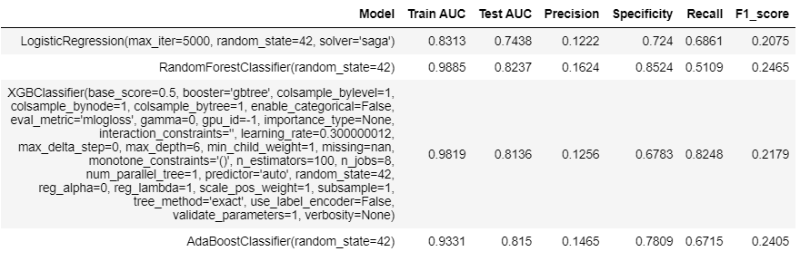
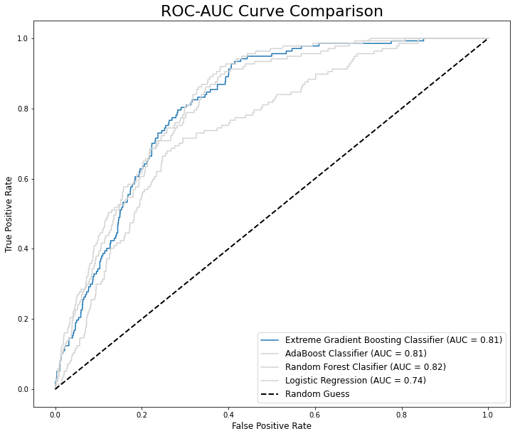
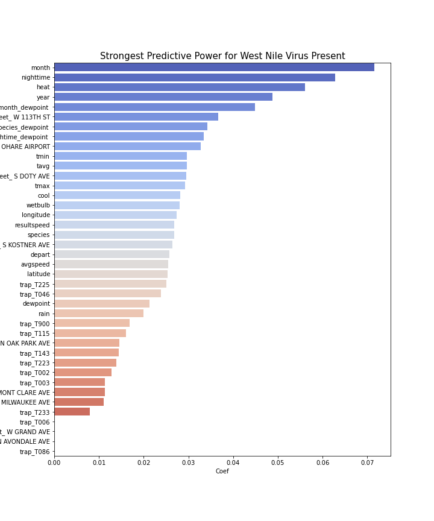

# West Nile Virus Prediction (Kaggle Competition)

## Executive Summary

The West Nile Virus is most commonly spread to humans through infected mosquitos. Around 20% of people who become infected with the virus develop symptoms ranging from a persistent fever, to serious neurological illnesses that can result in death.
West Nile Virus-related hospitalizations and follow-ups in the United States costed [$778 million](https://www.medicinenet.com/script/main/art.asp?articlekey=176668) in health care expenses and lost productivity from 1999 through 2012.

In 2002, the first human cases of the West Nile virus were reported in Chicago. By 2004 the City of Chicago and the Chicago Department of Public Health (CDPH) had established a comprehensive surveillance and control program, which is still in effect today. Since the implementation of comprehensive surveillances and control programmes, occurrences of the West Nile Virus has been depleting. 

As part of the last group project for General Assembly Immersive Data Science, our team aims to build a robust classifier model to predict the presence of the West Nile Virus in Chicago. The following models were tested and compared: Logistic Regression, Random Forest, Gradient Boosting and AdaBoost. Evaluation was performed primarily based on the AUC ROC, recall and precision scores. Finally, we looked into potential interventions derived from our model and performed a cost-benefit analysis for a proposal to The Chicago Department of Public Health (CDPH). 

## Problem Statement

Recognising that the West Nile Virus could develop into an endemic, we aim to improve the cost-effectiveness of existing strategies to control adult mosquito populations and mitigate the spread of the virus.

Capitalising on data on past weather conditions and locations where West Nile Virus were found, we look to develop a machine learning model to predict the presence of the West Nile Virus at a particular location facing specific weather conditions. This prediction tool will be useful as it allows for targeted spraying of specific neighbourhoods facing higher threats of the West Nile Virus. We hope to aid Chicago in achieving cost-savings through efficient resource-management towards preventing the transmission of the West Nile Virus.

## Data Dictionary

The datasets obtained from [Kaggle](https://www.kaggle.com/c/predict-west-nile-virus/data) are are as follows. 

|Data|Description|
|:---:|:---|
|[`train.csv`](/assets/train.csv)|There are 10,505 raw observations. Each observation contains location details on the traps, the number of mosquitoes collected and an indication of whether the West Nile Virus is present. The data is for traps tested in years 2007, 2009, 2011 and 2013.| 
|[`test.csv`](/assets/test.csv)|There are 116,293 raw observations. Each observation contains location details on the traps, the number of mosquitoes collected and an indication of whether the West Nile Virus is present. The data is for traps tested in years 2008, 2010, 2012, and 2014.| 
|[`weather.csv`](/assets/weather.csv)|Weather data collected from 2 weather stations between 1 May and 31 Oct from 2007 to 2014.|
|[`spray.csv`](/assets/spray.csv)|Data contains the date, time and location of spray in 2011 and 2013.|

## Analysis & Results

Five models were evaluated at the modelling stage. The models trained, tuned and compared were Extreme Gradient Boosting, Adaboost, Logistic Regression, Random Forest Classifier. Prior to model training, SMOTE was applied on the training dataset to fix the severe class imbalance. Next, a 2-stage pipeline was built for standard scaling on the train data before model training.
The performance metrics and ROC curve for each model is illustrated below:

Observation:

1. Based on the summary table, after hyperparamter tuning all our model is still overfitting as indicated by the gap between test and train scores.
2. Based on AUC-ROC curve, Random Forest Classifier, Extreme Gradient Boosting Classifier and AdaBoost Classifier models are same! However, Extreme Gradient Boosting Classifier model outperforming most of the models with highest recall score. 
4. Thus, Extreme Gradient Boosting Classifier model is choose as our production model.
    
For the selected product model based on XGB classifier, these are most predictive features:

## 4. Conclusion

Among our four models that we tuned (Xgboost, Adaboost, logistic Regression and Random Forest, XGBoost had the best performance as measured by AUC on the validation dataset.

Considering that we intend to use the model to predict potential West Nile Virus hotspots, the model should ideally achieve zero false negatives. Referring back the ROC curve from earlier we see that the optimal classification threshold is about 0.4 where the slope of the curve flattens out and we start seeing our TPR rising at marginal levels. However, using a classification threshold of 0.4 in a small number of false negatives. By lowering our classification threshold down to 0.25 we can lower our false negatives to zero while only lowering our TPR to ~0.8.

While a 20% error rate is not ideal, it is important to note that mosquito's typically travel 1-3 miles and a certain level of 'overspraying' is expected. In addition, spraying of misclassified areas will at least have the benefit of keeping mosquito populations low and it is expected that benefits are likely to outweigh costs as the added spray areas are near/ within residential areas.

## 5. Recommendations

Using our selected model we have identified that features relating to weather and location are the strongest predictors of the presence WNV.

At the selected threshold a significant majority of locations are identified as potential hotspots and spraying insecticide across all identified areas would essentially require city wide fogging that is not operationally and financially feasible.

Instead of preventing outbreaks across the entire city throughout the year, it would be more prudent to focus on areas with high resident populations, since the main detriments of a WNV outbreak are related to the cost of treatment and reduced economic output from worker absence and shocks to healthcare system.

Referring to our earlier plot of Chicago we can see that there when we overlay trap predicted and past locations where WNV was detected against population centres in Chicago, we recommend the following:

- a portion of predicted/ histroical locations with WNV present are located away from population centres. These areas should be skipped as benefit of spraying these areas is likely to be marginal considering the low resident population.

- Based on data on hand spraying done in the northern portion of Chicago is ideal as it effectively covers several population centres and wnv hotspots.

- To extend protection in this area frequency of fogging should be increased to cover the entirety of summer into mid September when temperatures start to fall.

- In addition other vector controls can be considered to remove breeding habitats between the months of May to June tackle the rise is mosquito populations typically seen in the summer months.

- Fogging activities should be expanded to cover hotspots in the southern portion of Chicago where there are several spots where the model predicts WNV that fall within population centres.

- Trap density in downtown Chicago is relatively low considering that a significant number of people work/reside in the area more traps should be put in the area to accurately assess the risk of the area.

## Team

Soon Zheng Foong

Brandon Loh

Ethan Tye

Tan Wee Hong 